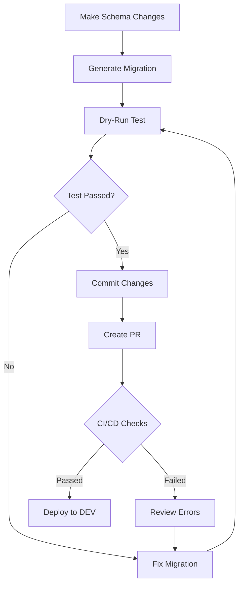
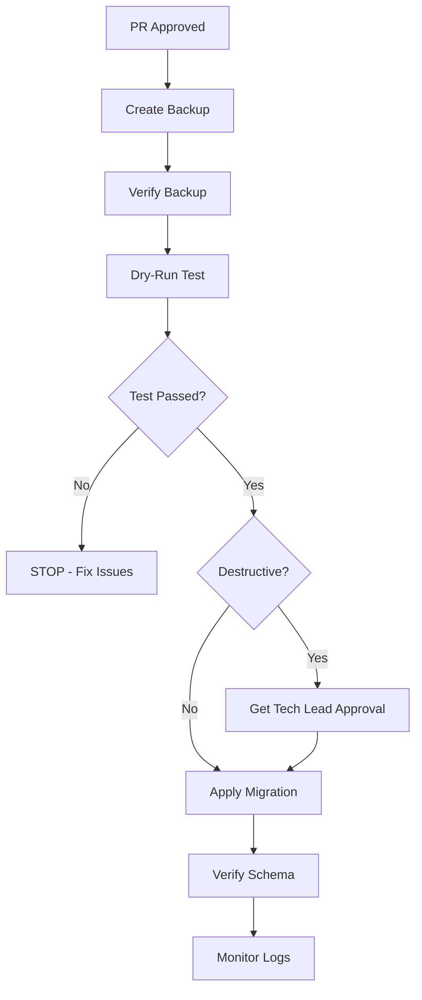

# Database Safety Tools

## Overview

This document describes the safety tools and procedures for managing database migrations. These tools help prevent data loss and ensure safe database changes.

## Available Tools

### 1. Backup Tool (`npm run db:backup`)

Creates full database backups before migrations.

**Usage:**

```bash
npm run db:backup [environment]

# Examples:
npm run db:backup local
npm run db:backup dev
npm run db:backup uat
npm run db:backup prod
```

**Features:**

- Creates compressed `.sql.gz` backup files
- Includes both schema and data
- Stores in `./backups/` directory
- Generates timestamped filenames
- Validates backup size and integrity

**Output Example:**

```
🔄 Starting backup for PROD database...

📊 Database: production_db
🖥️  Host: db.example.com:5432
👤 User: postgres
📋 Mode: Full backup (schema + data)
🗜️  Compression: Enabled

⏳ Creating backup...

✅ Backup completed successfully!
📁 Backup file: backups/backup-prod-2025-10-06T15-30-00.sql.gz
📊 Size: 156.42 MB
```

**When to Use:**

- ✅ **ALWAYS** before UAT migrations
- ✅ **ALWAYS** before PROD migrations
- ✅ Before any destructive operations
- ⚠️ Optional for DEV (recommended for major changes)

---

### 2. Dry-Run Tool (`npm run db:migrate:dryrun`)

Tests migrations without applying changes.

**Usage:**

```bash
npm run db:migrate:dryrun [environment]

# Examples:
npm run db:migrate:dryrun local
npm run db:migrate:dryrun uat
npm run db:migrate:dryrun prod
```

**Features:**

- Analyzes migrations for dangerous operations
- Detects: DROP TABLE, TRUNCATE, DELETE FROM, DROP COLUMN
- Warns about risky operations: ALTER TYPE, ADD NOT NULL, ADD UNIQUE
- Runs migration in a transaction
- Automatically rolls back (no changes made)
- Reports success/failure without affecting database

**Output Example:**

```
🧪 DRY RUN: Testing migrations for PROD database

📊 Analyzing pending migrations...

📝 Found 2 migration file(s):

📄 0006_add_user_preferences.sql
   Operations: CREATE TABLE (1x), CREATE INDEX (2x)

📄 0007_alter_orders_table.sql
   Operations: ALTER TABLE (1x), DROP COLUMN (1x)
   ⚠️  DESTRUCTIVE: DROP COLUMN - Will permanently delete column data

⚠️  WARNING: Dangerous operations detected!
⚠️  These operations may cause data loss if applied.

🔄 Testing migration in transaction...

✓ Transaction started
✓ Migrations applied successfully
✓ Database has 15 tables after migration
✓ Rolling back transaction...

✅ DRY RUN COMPLETE: Migrations would succeed!
✅ No changes were made to the database.

💡 Next Steps:
   1. Review the migration operations above
   2. Create a backup: npm run db:backup prod
   3. Apply migrations: npm run db:migrate prod
   4. Verify database: npm run db:compare local prod
```

**When to Use:**

- ✅ **ALWAYS** before UAT migrations
- ✅ **ALWAYS** before PROD migrations
- ✅ After generating new migrations
- ✅ Before committing migrations to version control

---

### 3. Schema Comparison Tool (`npm run db:compare`)

Compares schemas across environments.

**Usage:**

```bash
npm run db:compare [source] [target]

# Examples:
npm run db:compare local dev
npm run db:compare dev uat
npm run db:compare uat prod
```

**Features:**

- Side-by-side schema comparison
- Detects missing tables and columns
- Identifies type mismatches
- Flags breaking changes
- Beautiful CLI output with color coding
- Exits with error code if incompatible

**When to Use:**

- ✅ Before deploying to each environment
- ✅ After applying migrations
- ✅ During code review
- ✅ When debugging schema issues

---

### 4. Metadata Refresh Tool (DevOps UI)

Refreshes cached metadata for remote databases.

**Usage:**

1. Navigate to: http://localhost:3000/devops/schema-comparison
2. Select target environment (dev, uat, or prod)
3. Click "🔄 Refresh Metadata" button

**Features:**

- Updates metadata cache on-demand
- Calls stored procedure on remote database
- Shows loading state during refresh
- Displays success/error notifications

**When to Use:**

- ✅ Before schema comparisons
- ✅ After applying migrations on remote environments
- ✅ When comparison results seem outdated

---

## Safety Workflow

### For All Environments



### For UAT/PROD (Extra Safety)



---

## Recommended Safety Checklist

### Before Every Migration

- [ ] **Schema changes reviewed** - Code review completed
- [ ] **Migration generated** - Using `npm run db:generate`
- [ ] **Dry-run passed** - Using `npm run db:migrate:dryrun`
- [ ] **Schema compared** - No unexpected differences

### Before UAT/PROD Migration

- [ ] **Backup created** - Using `npm run db:backup`
- [ ] **Backup verified** - Check file size and integrity
- [ ] **Dry-run on target** - Test on actual environment
- [ ] **Rollback plan** - Document how to revert
- [ ] **Maintenance window** - Scheduled if needed
- [ ] **Team notified** - Inform stakeholders

### After Migration

- [ ] **Schema verified** - Run comparison again
- [ ] **Application tested** - Basic functionality check
- [ ] **Logs monitored** - Check for errors
- [ ] **Backup retained** - Keep for recovery period

---

## Emergency Procedures

### If Migration Fails

1. **DO NOT PANIC** - The dry-run should have caught this
2. **Check logs** - Identify the specific error
3. **Assess impact** - Is data lost or just migration failed?
4. **Restore if needed**:
   ```bash
   # Restore from latest backup
   gunzip -c backups/backup-prod-latest.sql.gz | psql -h HOST -U USER -d DATABASE
   ```
5. **Fix migration** - Correct the SQL
6. **Test again** - Run dry-run before retrying

### If Data Lost

1. **STOP** - Prevent further damage
2. **Restore immediately**:
   ```bash
   gunzip -c backups/backup-prod-[timestamp].sql.gz | psql -h HOST -U USER -d DATABASE
   ```
3. **Document incident** - What happened, when, why
4. **Post-mortem** - Improve processes to prevent recurrence

---

## GitHub Actions Integration

The `.github/workflows/schema-validation.yml` workflow automatically:

1. ✅ **Detects schema changes** - Checks if `schema-pg.ts` modified
2. ✅ **Requires migrations** - Fails if no migration file added
3. ✅ **Validates SQL syntax** - Basic syntax checking
4. ⚠️ **Warns about destructive ops** - Flags DROP, TRUNCATE, DELETE
5. 🚫 **Blocks dangerous ops** - Requires `[DANGEROUS-APPROVED]` in PR title
6. 💬 **Comments on PR** - Provides checklist and commands
7. 📊 **Compares schemas** - Runs comparison with DEV (if configured)

---

## Best Practices

### DO:

- ✅ Always backup before UAT/PROD migrations
- ✅ Always dry-run before applying migrations
- ✅ Test migrations on production-like data
- ✅ Compare schemas after migrations
- ✅ Keep backups for compliance periods
- ✅ Document rollback plans for destructive changes
- ✅ Test backup restore procedures regularly

### DON'T:

- ❌ Skip backups "because it's just a small change"
- ❌ Run migrations on prod without dry-run
- ❌ Delete backups immediately after migration
- ❌ Assume migrations will work because they worked locally
- ❌ Make schema changes without migrations
- ❌ Trust backups you haven't tested restoring

---

## Tool Reference

| Tool     | Command                           | Purpose                         | Required For |
| -------- | --------------------------------- | ------------------------------- | ------------ |
| Backup   | `npm run db:backup [env]`         | Create full database backup     | UAT, PROD    |
| Dry-run  | `npm run db:migrate:dryrun [env]` | Test migration without applying | ALL          |
| Compare  | `npm run db:compare [src] [tgt]`  | Compare schemas                 | ALL          |
| Refresh  | DevOps UI → Refresh Metadata      | Update metadata cache           | As needed    |
| Generate | `npm run db:generate`             | Create migration from schema    | ALL          |
| Migrate  | `npm run db:migrate [env]`        | Apply migrations                | ALL          |

---

## Support & Questions

- **Documentation**: `docs/DATABASE_CHANGE_MANAGEMENT.md`
- **Schema Comparison UI**: http://localhost:3000/devops/schema-comparison
- **GitHub Workflow**: `.github/workflows/schema-validation.yml`
- **Backup Script**: `scripts/backup-database.ts`
- **Dry-run Script**: `scripts/migrate-dryrun.ts`
- **Compare Script**: `scripts/compare-schemas.ts`

---

**Remember: Data loss is permanent. Always backup. Always dry-run. Always verify.**
