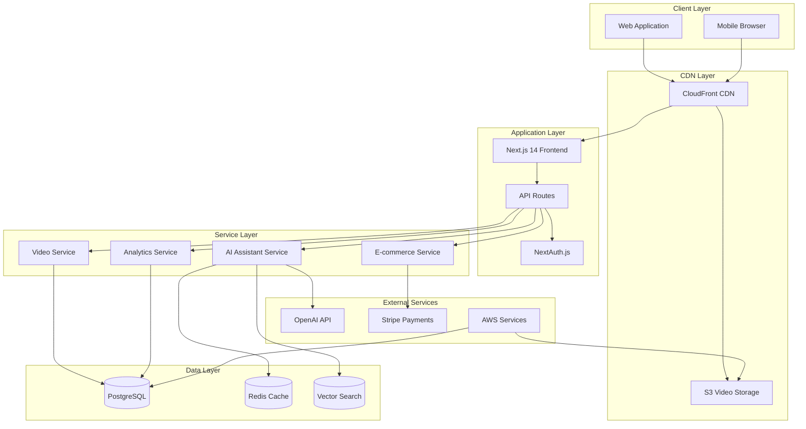

# Fullstack Architecture Document
**Two-Phase Cooling Education Center Website**

## Document Overview

This comprehensive architecture document defines the complete technical design for the Two-Phase Cooling Education Center website. The platform combines educational video content, AI-powered technical assistance, and e-commerce functionality to create an innovative "experience over selling" approach for advanced cooling technology.

### Document Structure

This architecture is organized into focused sections for maintainability and clarity:

1. **[Tech Stack & Infrastructure](./architecture/tech-stack.md)** - Definitive technology selections and API specifications
2. **[Data Models & Components](./architecture/data-models.md)** - Database schema and component architecture
3. **[Frontend & Backend Architecture](./architecture/frontend-backend.md)** - Application structure and implementation patterns
4. **[Development & Deployment](./architecture/development-deployment.md)** - Workflow, CI/CD, and infrastructure management
5. **[Security & Monitoring](./architecture/security-monitoring.md)** - Security implementation and observability strategy

## High-Level Architecture Summary

### Technical Philosophy

**Serverless-First, Video-Optimized Platform**
- Next.js 14 with React Server Components for optimal performance
- AWS Lambda microservices for scalability and cost efficiency
- Global CDN distribution for 4K video content delivery
- AI-powered educational assistance with contextual awareness

### Core Architecture Principles

1. **Performance-Driven**: Sub-3-second page loads, sub-2-second video start times
2. **Educational-Focused**: Progressive content disclosure based on user understanding
3. **Scalable by Design**: Serverless architecture supporting traffic spikes during YouTube reviews
4. **Security-First**: PCI DSS compliance, data encryption, comprehensive input validation
5. **Observable**: Real-time monitoring, error tracking, and performance analytics

### Platform Components

### Architectural Patterns

#### 1. Jamstack + Serverless Microservices
- **Static Generation**: Pre-rendered content for SEO and performance
- **API Routes**: Serverless functions for dynamic functionality
- **Edge Computing**: Global content delivery and processing

#### 2. Progressive Enhancement
- **Server Components**: Initial page rendering without JavaScript
- **Client Hydration**: Interactive features load progressively
- **Offline Capability**: Service worker for video caching

#### 3. Context-Aware AI Pattern
- **Session Management**: Persistent conversation context
- **Knowledge Integration**: Vector search with educational content
- **Contextual Responses**: AI adapts to user's learning progress

#### 4. Event-Driven Architecture
- **Progress Tracking**: Real-time learning analytics
- **Video Events**: Engagement metrics and completion tracking
- **Commerce Events**: Cart updates and order processing

## Key Technical Decisions

### 1. Next.js 14 with App Router
**Rationale**: React Server Components provide optimal performance for video-heavy content while maintaining interactivity for AI chat and e-commerce features.

### 2. PostgreSQL + Prisma ORM
**Rationale**: ACID compliance for e-commerce transactions, JSON support for flexible video metadata, excellent TypeScript integration.

### 3. AWS Lambda + Vercel Hosting
**Rationale**: Serverless scalability for traffic spikes during YouTube tech channel reviews, cost efficiency for variable workloads.

### 4. OpenAI GPT-4 Integration
**Rationale**: Technical accuracy for complex cooling science questions, conversation quality for educational engagement.

### 5. Stripe Payment Processing
**Rationale**: PCI DSS compliance, comprehensive features for subscription potential, trusted by target tech enthusiast audience.

## Performance Targets

### Core Web Vitals
- **Largest Contentful Paint (LCP)**: < 2.5 seconds
- **First Input Delay (FID)**: < 100 milliseconds
- **Cumulative Layout Shift (CLS)**: < 0.1

### Application Performance
- **Page Load Time**: < 3 seconds (initial load)
- **Video Start Time**: < 2 seconds (first frame)
- **API Response Time**: < 500ms (95th percentile)
- **AI Response Time**: < 3 seconds (standard questions)

### Scalability Targets
- **Concurrent Users**: 10,000+ during peak traffic
- **Video Bandwidth**: 500+ Mbps sustained delivery
- **Database Connections**: 1,000+ concurrent connections
- **Uptime**: 99.9% availability target

## Development Methodology

### BMad-Driven Architecture
This architecture follows the BMad methodology's agent-driven development approach:

1. **Analyst Mary**: Market research and brainstorming informed the educational-first design
2. **PM John**: Product requirements shaped the MVP feature prioritization
3. **UX Expert Sally**: User experience research defined the progressive disclosure patterns
4. **Architect Winston**: Technical expertise synthesized into this comprehensive architecture

### Implementation Phases

#### Phase 1: MVP Foundation (Months 1-2)
- Core video delivery platform
- Basic AI technical assistant
- Simple e-commerce integration
- Essential security implementation

#### Phase 2: Enhanced Features (Months 3-4)
- Advanced AI contextual awareness
- Interactive learning progress tracking
- Performance optimization
- Comprehensive monitoring

#### Phase 3: Scale & Polish (Months 5-6)
- Multi-camera angle support
- Community features foundation
- Advanced analytics
- YouTube integration tools

## Success Metrics

### Technical Performance
- **Page Load Speed**: Maintain sub-3-second loads under traffic spikes
- **Video Delivery**: 99.9% successful video starts within 2 seconds
- **API Reliability**: 99.95% uptime for critical e-commerce endpoints
- **AI Response Quality**: 95%+ user satisfaction with technical answers

### Business Impact
- **Educational Engagement**: 8+ minute average session time
- **Conversion Optimization**: 3-5% purchase conversion rate
- **Revenue Performance**: $50+ revenue per visitor
- **Scalability Proof**: Handle 10x traffic during major YouTube reviews

## Risk Mitigation

### Technical Risks
1. **Video Delivery Failures**: Multi-CDN strategy with automatic failover
2. **AI Service Limitations**: Caching layer with graceful degradation
3. **Database Performance**: Read replicas and connection pooling
4. **Security Vulnerabilities**: Automated security scanning and regular audits

### Operational Risks
1. **Traffic Spikes**: Auto-scaling infrastructure with CloudFront buffering
2. **Third-Party Dependencies**: Circuit breakers and timeout handling
3. **Data Loss**: Automated backups with point-in-time recovery
4. **Performance Degradation**: Real-time monitoring with automated alerts

## Next Steps

1. **Environment Setup**: Initialize development infrastructure following the development workflow guide
2. **Core Implementation**: Begin with video delivery platform as the foundation
3. **Iterative Development**: Implement features in priority order with continuous testing
4. **Performance Validation**: Establish monitoring and conduct load testing
5. **Security Hardening**: Implement security measures with penetration testing

---

**Architecture Version**: v1.0
**Last Updated**: 2025-09-20
**Next Review**: Upon MVP completion
**Approvals Required**: Technical Lead, Product Manager, Security Team