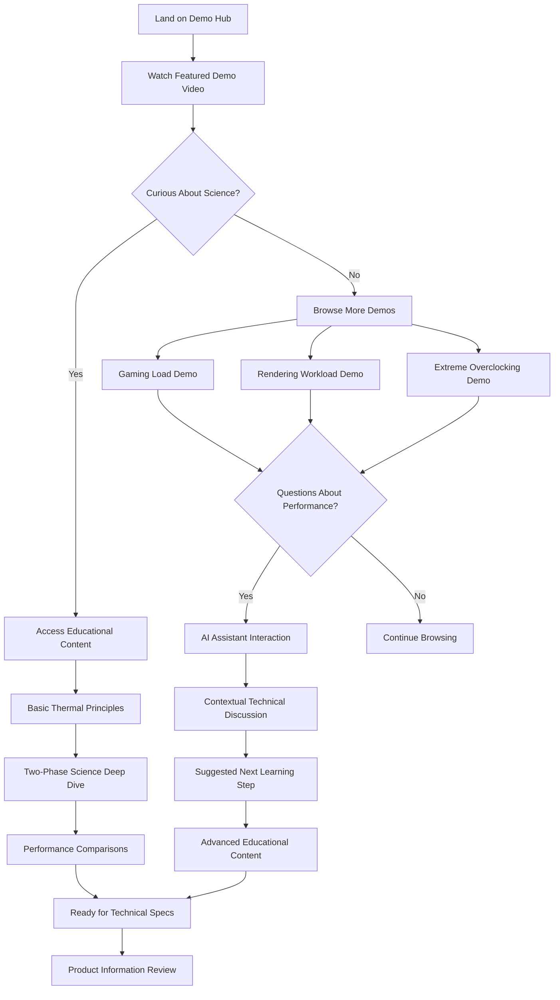
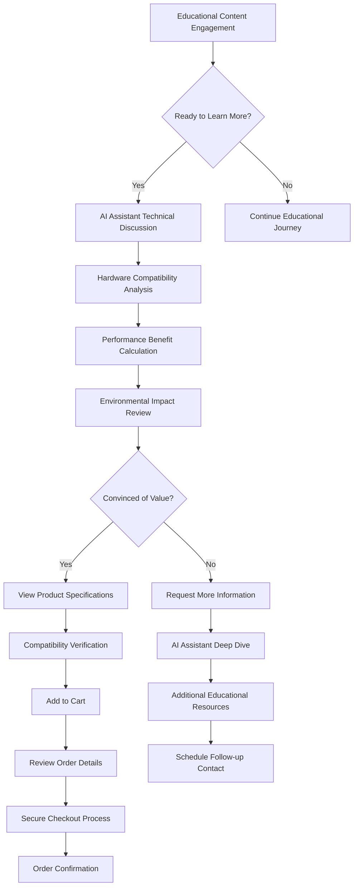
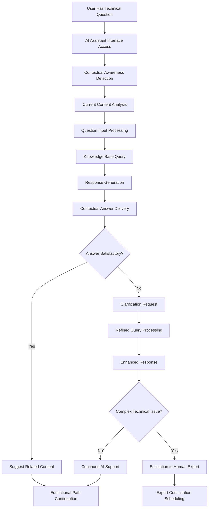

# Two-Phase Cooling Education Center Website UI/UX Specification

## Introduction

This document defines the user experience goals, information architecture, user flows, and visual design specifications for **Two-Phase Cooling Education Center Website**'s user interface. It serves as the foundation for visual design and frontend development, ensuring a cohesive and user-centered experience.

### Overall UX Goals & Principles

#### Target User Personas

**Primary Persona - "The Technical Enthusiast"**
- **Profile**: PC builders aged 25-45 with strong technical backgrounds, earning $75K+, primarily in USA market
- **Goals**: Understand cooling science deeply, achieve unthrottled performance, create visually impressive builds
- **Pain Points**: Knowledge gap in advanced cooling, thermal throttling issues, lack of scientific education in product marketing
- **Behavior**: Researches extensively, values understanding over quick purchases, participates in enthusiast communities

**Secondary Persona - "The Performance Professional"**
- **Profile**: Content creators, engineers, competitive gamers who need maximum sustained performance
- **Goals**: Reliable cooling for mission-critical workloads, understanding ROI of premium cooling solutions
- **Pain Points**: Traditional cooling inadequate for high-TDP components, need for both performance and aesthetics
- **Behavior**: Values enterprise-grade reliability, seeks evidence-based performance claims

#### Usability Goals

- **Educational Engagement**: Users can progress from basic thermal concepts to advanced two-phase understanding within 15-20 minutes
- **Discovery Efficiency**: Key demonstration videos accessible within 2 clicks from any page
- **Learning Retention**: AI assistant enables users to get immediate answers without leaving educational context
- **Conversion Flow**: Natural progression from education to purchase without aggressive sales tactics
- **Mobile Accessibility**: Core educational content and AI assistant fully functional on mobile devices

#### Design Principles

1. **Science Over Marketing** - Lead with educational content and visual demonstrations rather than traditional product promotion
2. **Progressive Visual Disclosure** - Guide users from dramatic "circuits getting wet" visuals to deep technical understanding
3. **Laboratory Aesthetic** - Professional, high-tech visual language that builds credibility and trust
4. **Contextual Intelligence** - AI assistant integration feels natural and immediate, not like separate chat tool
5. **Performance Transparency** - Visual data and thermal imaging prominently displayed to support scientific claims

### Change Log

| Date | Version | Description | Author |
|------|---------|-------------|---------|
| 2025-09-20 | 1.0 | Initial UI/UX specification creation | Sally (UX Expert) |

## Information Architecture (IA)

### Site Map / Screen Inventory

```mermaid
graph TD
    A[Landing Page / Live Demo Hub] --> B[Educational Library]
    A --> C[Thermal Comparison Gallery]
    A --> D[AI Assistant Interface]
    A --> E[Product Information]
    A --> F[About Technology]

    B --> B1[Basic Thermal Principles]
    B --> B2[Two-Phase Cooling Science]
    B --> B3[Performance Comparisons]
    B --> B4[Enterprise Heritage]
    B --> B5[Environmental Benefits]

    C --> C1[Gaming Load Comparisons]
    C --> C2[Rendering Workload Tests]
    C --> C3[Extreme Overclocking Demos]
    C --> C4[FLIR Thermal Imaging]

    D --> D1[Contextual Q&A]
    D --> D2[Technical Deep Dive]
    D --> D3[Suggested Learning Paths]

    E --> E1[Product Specifications]
    E --> E2[Compatibility Guide]
    E --> E3[Shopping Cart]
    E --> E4[Checkout Process]

    F --> F1[Scientific Principles]
    F --> F2[Enterprise Use Cases]
    F --> F3[Environmental Impact]
    F --> F4[Technology Roadmap]

    E3 --> G[Order Confirmation]
    E4 --> G
```

### Navigation Structure

**Primary Navigation:** Video-first discovery navigation with educational progression embedded. Main navigation includes: "Live Demonstrations", "Learn Thermal Science", "Compare Performance", "Technical Specs", and prominent AI Assistant access throughout.

**Secondary Navigation:** Context-sensitive educational pathways that appear based on current content. For example, while viewing basic thermal principles, show progression to two-phase cooling science. Within demonstration videos, show related comparison content.

**Breadcrumb Strategy:** Educational progression breadcrumbs that show learning path rather than traditional site hierarchy. Examples: "Thermal Basics → Two-Phase Science → Performance Data" or "Gaming Demo → FLIR Analysis → Technical Discussion"

## User Flows

### Educational Discovery Flow

**User Goal:** Understand two-phase cooling technology through progressive educational content

**Entry Points:** Landing page, social media links, YouTube review mentions, search results

**Success Criteria:** User progresses from basic thermal concepts to advanced understanding, engages with AI assistant, views multiple demonstration videos

#### Flow Diagram

#### Edge Cases & Error Handling:
- Video loading failure: Show static images with technical specifications
- AI assistant unavailable: Provide FAQ links and knowledge base search
- Mobile video performance: Adaptive streaming with quality selection
- User abandonment: Email capture for educational content series

**Notes:** This flow emphasizes discovery and learning over immediate conversion, supporting the "education over selling" philosophy

### Purchase Decision Flow

**User Goal:** Make informed purchasing decision based on educational understanding

**Entry Points:** Educational content, demonstration videos, AI assistant recommendations, direct product page access

**Success Criteria:** User completes purchase with confidence in technology understanding

#### Flow Diagram

#### Edge Cases & Error Handling:
- Incompatible hardware: Clear explanation with alternative recommendations
- Payment processing failure: Multiple payment options and clear error messaging
- Shipping restrictions: Geographic validation with explanation
- Cart abandonment: Educational content email series with purchase incentives

**Notes:** Flow maintains educational context throughout purchase process, with AI assistant providing technical consultation

### AI Assistant Interaction Flow

**User Goal:** Get immediate, contextual answers to technical questions during educational journey

**Entry Points:** Any educational content page, demonstration videos, product specifications, contextual prompts

**Success Criteria:** User receives accurate, helpful technical information that enhances understanding and confidence

#### Flow Diagram

#### Edge Cases & Error Handling:
- AI knowledge gaps: Graceful escalation with apology and human expert option
- Complex multi-part questions: Break down into manageable components
- Off-topic questions: Gentle redirection to cooling technology focus
- System overload: Queue management with expected response times

**Notes:** AI assistant maintains context awareness throughout user session, providing increasingly sophisticated support as user demonstrates technical knowledge

## Wireframes & Mockups

**Primary Design Files:** [To be created in Figma - recommend dedicated project for Two-Phase Cooling Education Center]

### Key Screen Layouts

#### Landing Page / Demo Hub

**Purpose:** Immediate visual impact with dramatic cooling demonstration, eliminating traditional marketing in favor of "experience over selling"

**Key Elements:**
- **Hero Video Player**: Full-width featured demonstration showing "circuits getting wet" with professional cinematography
- **Performance Metrics Overlay**: Real-time temperature, clock speed, and power consumption data during stress testing
- **FLIR Thermal Comparison**: Split-screen thermal imaging showing traditional vs. two-phase cooling side-by-side
- **AI Assistant Entry Point**: Contextual chat interface with suggested questions like "How does liquid cooling high-voltage components work safely?"
- **Educational Navigation**: Progressive disclosure menu leading to thermal science principles
- **Demonstration Categories**: Quick access to gaming loads, rendering workloads, extreme overclocking scenarios

**Interaction Notes:** Video controls optimized for educational viewing (chapter markers, slow-motion capability, frame-by-frame analysis). AI assistant appears as overlay without interrupting video experience.

**Design File Reference:** [Figma Frame: Landing-Demo-Hub-Desktop / Landing-Demo-Hub-Mobile]

#### Educational Content Library

**Purpose:** Progressive learning interface that guides users from basic thermal concepts to advanced two-phase cooling science

**Key Elements:**
- **Learning Path Visualization**: Interactive diagram showing progression from thermal basics through advanced concepts
- **Content Cards**: Video demonstrations integrated with educational articles, each with completion tracking
- **Knowledge Prerequisites**: Clear indicators of foundational concepts needed before advanced topics
- **AI Learning Companion**: Persistent assistant that suggests next steps based on current understanding level
- **Visual Science Elements**: Diagrams, animations, and interactive thermal dynamics visualizations
- **Community Insights**: User-generated questions and expert responses integrated with formal content

**Interaction Notes:** Content adapts based on user engagement patterns. AI assistant provides contextual explanations for complex concepts. Progress tracking motivates completion of educational pathways.

**Design File Reference:** [Figma Frame: Educational-Library-Desktop / Educational-Library-Mobile]

#### AI Technical Assistant Interface

**Purpose:** Contextual technical support that enhances educational experience without disrupting learning flow

**Key Elements:**
- **Context-Aware Chat Interface**: Understands current video or educational content being viewed
- **Suggested Question Prompts**: Common questions relevant to current content (e.g., "Why doesn't this short-circuit?" while viewing liquid cooling demo)
- **Technical Diagram Integration**: AI can display relevant thermal diagrams, performance charts, compatibility guides
- **Conversation History**: Maintains session context for building understanding over time
- **Escalation Options**: Clear path to human expert consultation for complex scenarios
- **Knowledge Confidence Indicators**: Shows AI certainty level and provides sources for technical claims

**Interaction Notes:** Interface appears as contextual overlay or sidebar that doesn't interrupt video viewing. Voice interaction option for hands-free learning during demonstrations.

**Design File Reference:** [Figma Frame: AI-Assistant-Overlay / AI-Assistant-Sidebar]

#### Product Specification & Purchase Flow

**Purpose:** Technical product information presented as natural progression from educational understanding

**Key Elements:**
- **Educational Context Integration**: Product specs linked to relevant demonstrations and scientific principles
- **Compatibility Analysis Tool**: Interactive checker for user's current hardware configuration
- **Performance Benefit Calculator**: Personalized thermal improvement projections based on user's system
- **Environmental Impact Summary**: GWP and ODP data presented with context and comparisons
- **Purchase Confidence Indicators**: Educational journey completion status and AI assistant consultation summary
- **Streamlined Checkout**: USA shipping focus with minimal friction for educated customers

**Interaction Notes:** AI assistant remains available throughout purchase process for technical consultation. Product information emphasizes scientific validation over marketing claims.

**Design File Reference:** [Figma Frame: Product-Specs-Desktop / Product-Specs-Mobile / Checkout-Flow]

## Component Library / Design System

**Design System Approach:** Create custom design system emphasizing scientific precision and laboratory aesthetics. Build on Material Design or Ant Design foundation but customize heavily for technical credibility and educational focus.

### Core Components

#### Video Player Component

**Purpose:** Primary interface for educational demonstration content with advanced controls for technical analysis

**Variants:**
- Hero player (full-width landing page)
- Comparison player (side-by-side thermal imaging)
- Embedded player (within educational content)
- Mobile player (touch-optimized)

**States:** Loading, playing, paused, buffering, error, chapter navigation, slow-motion mode, frame-by-frame analysis

**Usage Guidelines:** Always include performance data overlay option, chapter markers for key demonstration moments, and contextual AI assistant access point

#### AI Assistant Interface

**Purpose:** Contextual technical support that integrates seamlessly with educational content

**Variants:**
- Overlay mode (appears over video content)
- Sidebar mode (persistent during educational reading)
- Mobile drawer (slides up from bottom)
- Minimized indicator (shows assistant availability)

**States:** Idle, listening, processing, responding, error, escalation available, context-aware, conversation history

**Usage Guidelines:** Maintain educational context awareness, provide suggested questions relevant to current content, ensure accessibility for voice interaction

#### Performance Metrics Display

**Purpose:** Real-time system monitoring data that makes thermal performance tangible

**Variants:**
- Overlay charts (transparent over video)
- Dashboard widgets (detailed technical view)
- Comparison displays (traditional vs. two-phase)
- Mobile-optimized gauges

**States:** Real-time updating, historical view, comparison mode, alert thresholds, calibration mode

**Usage Guidelines:** Use consistent color coding for temperature ranges, provide clear legends, ensure readability over video content

#### Educational Progress Tracker

**Purpose:** Visual representation of learning journey completion and next steps

**Variants:**
- Circular progress indicators
- Linear pathway visualization
- Achievement badges
- Knowledge tree diagram

**States:** Not started, in progress, completed, prerequisite required, expert level achieved

**Usage Guidelines:** Motivate continued learning without pressure, clearly indicate prerequisite relationships, celebrate educational milestones

## Branding & Style Guide

### Visual Identity

**Brand Guidelines:** Scientific laboratory aesthetic with premium engineering precision. Emphasize transparency, technical excellence, and educational authority over consumer marketing approaches.

### Color Palette

| Color Type | Hex Code | Usage |
|------------|----------|--------|
| Primary | #0066CC | Technical data, primary CTAs, educational progress |
| Secondary | #00A3E0 | Secondary actions, highlights, thermal cool zones |
| Accent | #FF6B35 | Thermal hot zones, alerts, performance warnings |
| Success | #28A745 | Optimal performance, educational completions |
| Warning | #FFC107 | Thermal cautions, system recommendations |
| Error | #DC3545 | Critical temperatures, system failures |
| Neutral | #F8F9FA, #6C757D, #343A40 | Text, borders, backgrounds |

### Typography

#### Font Families
- **Primary:** Inter (modern, technical clarity, excellent readability)
- **Secondary:** JetBrains Mono (technical specifications, code, precise data)
- **Display:** Orbitron (futuristic headings, scientific branding)

#### Type Scale

| Element | Size | Weight | Line Height |
|---------|------|--------|-------------|
| H1 | 2.5rem | 700 | 1.2 |
| H2 | 2rem | 600 | 1.3 |
| H3 | 1.5rem | 600 | 1.4 |
| Body | 1rem | 400 | 1.6 |
| Small | 0.875rem | 400 | 1.5 |

### Iconography

**Icon Library:** Feather Icons for UI elements, custom technical icons for thermal concepts (heat flow, phase transitions, cooling zones)

**Usage Guidelines:** Maintain consistent stroke width, use outline style for technical precision, ensure accessibility with proper labels

### Spacing & Layout

**Grid System:** 8px base grid with 12-column layout for desktop, 4-column for mobile

**Spacing Scale:** 4px, 8px, 16px, 24px, 32px, 48px, 64px (based on 8px system for consistent rhythm)

## Accessibility Requirements

### Compliance Target

**Standard:** WCAG 2.1 AA compliance with specific emphasis on multimedia accessibility for educational content

### Key Requirements

**Visual:**
- Color contrast ratios: 4.5:1 for normal text, 3:1 for large text, with special attention to thermal data overlays on video content
- Focus indicators: 2px blue outline with 4px offset for all interactive elements, including video controls and AI assistant interface
- Text sizing: Minimum 16px base font size, scalable to 200% without horizontal scrolling

**Interaction:**
- Keyboard navigation: Full video player control via keyboard, AI assistant accessible via keyboard shortcuts, logical tab order through educational content
- Screen reader support: Comprehensive ARIA labels for video controls, live regions for AI assistant responses, descriptive text for thermal imaging content
- Touch targets: Minimum 44px touch targets for mobile video controls and AI assistant interface

**Content:**
- Alternative text: Detailed descriptions for thermal imaging content, transcripts for all demonstration videos, text alternatives for performance charts
- Heading structure: Logical H1-H6 hierarchy throughout educational content, clear section identification for screen readers
- Form labels: Clear labeling for AI assistant input fields, product specification filters, checkout forms

### Testing Strategy

Automated accessibility testing with axe-core integration, manual testing with screen readers (NVDA, JAWS, VoiceOver), keyboard-only navigation testing, and user testing with assistive technology users, particularly for complex video and AI interaction scenarios.

## Responsiveness Strategy

### Breakpoints

| Breakpoint | Min Width | Max Width | Target Devices |
|------------|-----------|-----------|----------------|
| Mobile | 320px | 767px | Smartphones, compact educational viewing |
| Tablet | 768px | 1023px | Tablets, educational content consumption |
| Desktop | 1024px | 1439px | Laptops, detailed technical analysis |
| Wide | 1440px | - | Large displays, multi-video comparisons |

### Adaptation Patterns

**Layout Changes:** Mobile prioritizes single-video viewing with collapsible AI assistant drawer. Tablet enables side-by-side comparison viewing. Desktop supports complex multi-panel layouts with persistent AI assistant sidebar.

**Navigation Changes:** Mobile uses hamburger menu with educational path shortcuts. Tablet shows condensed navigation bar. Desktop displays full navigation with contextual educational breadcrumbs.

**Content Priority:** Mobile focuses on primary demonstration videos with AI assistant access. Educational content presented in digestible cards. Desktop shows comprehensive layouts with multiple content streams.

**Interaction Changes:** Mobile emphasizes touch-friendly video controls and voice-activated AI assistant. Desktop supports advanced keyboard shortcuts and multi-window educational content browsing.

## Animation & Micro-interactions

### Motion Principles

Subtle, purposeful motion that enhances educational comprehension without distraction. Thermal data visualizations use smooth transitions to show temperature changes. AI assistant responses appear with gentle fade-in. Educational progress indicators use satisfying completion animations.

### Key Animations

- **Video Transition Effects:** Smooth crossfades between demonstration videos (300ms, ease-out)
- **AI Assistant Appearance:** Contextual slide-in from relevant screen edge (250ms, ease-in-out)
- **Thermal Data Updates:** Smooth value interpolation for temperature displays (150ms, linear)
- **Educational Progress:** Satisfying fill animation for learning completion (500ms, ease-out)
- **Navigation Transitions:** Contextual page transitions that maintain educational flow (200ms, ease-in-out)

## Performance Considerations

### Performance Goals

- **Page Load:** <3 seconds initial load with progressive video loading
- **Interaction Response:** <100ms for AI assistant interface, <50ms for video controls
- **Animation FPS:** 60fps for all thermal data visualizations and UI animations

### Design Strategies

Lazy loading for non-critical educational content, progressive enhancement for AI assistant features, optimized video encoding with adaptive streaming, critical CSS inlining for immediate visual feedback, and performance budgets for educational content complexity.

## Next Steps

### Immediate Actions

1. **Stakeholder Review Session** - Present UI/UX specification to development team and business stakeholders
2. **Figma Design Creation** - Create detailed visual designs for all key screen layouts
3. **Component Library Development** - Build design system components in Figma with detailed specifications
4. **Accessibility Audit Plan** - Establish testing procedures for WCAG 2.1 AA compliance
5. **Performance Budget Definition** - Set specific metrics for video delivery and AI assistant response times
6. **User Testing Strategy** - Plan usability testing with target technical enthusiast personas

### Design Handoff Checklist

- [x] All user flows documented
- [x] Component inventory complete
- [x] Accessibility requirements defined
- [x] Responsive strategy clear
- [x] Brand guidelines incorporated
- [x] Performance goals established

## Checklist Results

**UI/UX Specification Validation:**

✅ **User-Centered Design**: All decisions rooted in technical enthusiast personas and educational goals
✅ **Information Architecture**: Video-first structure supports "experience over selling" philosophy
✅ **User Flow Completeness**: Educational discovery, purchase decision, and AI interaction flows comprehensively documented
✅ **Component Strategy**: Custom design system balances scientific credibility with user experience excellence
✅ **Accessibility Foundation**: WCAG 2.1 AA compliance planned with multimedia-specific considerations
✅ **Responsive Design**: Multi-device strategy prioritizes educational content consumption patterns
✅ **Performance Integration**: UX design aligned with technical performance requirements
✅ **Brand Integration**: Laboratory aesthetic supports educational mission and technical credibility

**Ready for Implementation**: UI/UX specification provides comprehensive foundation for Figma design creation and frontend development.